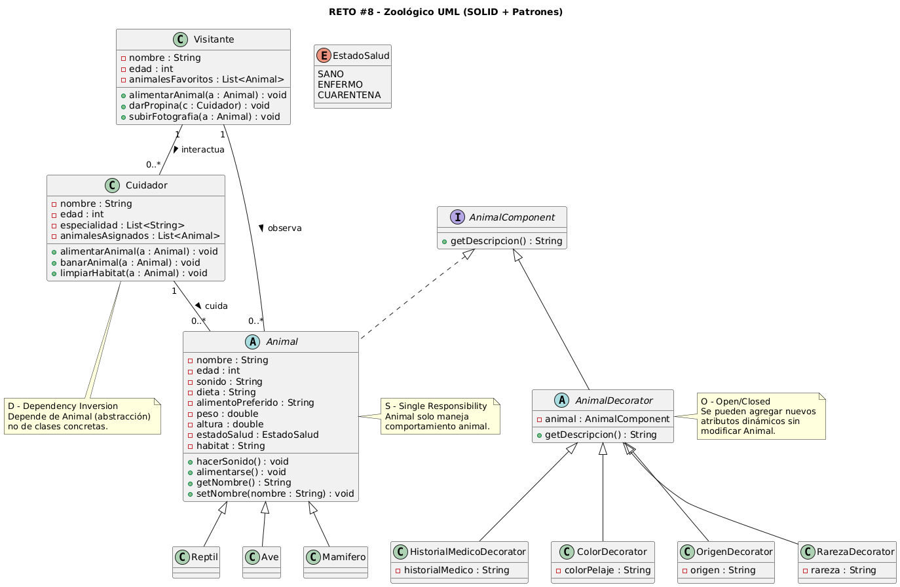

# DOSW_LAB8_ZoologicoUML_Bogota-Segura-Velez

##  Reto #8: El Zoológico de los UML

### 👥 Integrantes del grupo
- **Kevin Segura**
- **Juan David Vélez**
- **Juan Bogotá**

---

##  Descripción del reto
En este reto se diseñó un sistema de gestión para un zoológico que cuenta con animales de distintas especies como mamíferos, reptiles y aves.

Cada animal posee atributos como nombre, edad, sonido característico, dieta, alimento preferido, peso, altura, estado de salud y hábitat.

El sistema también contempla:

- Cuidadores que pueden alimentar, bañar y limpiar el hábitat de los animales.
- Visitantes que pueden interactuar con animales y cuidadores.
- La posibilidad de agregar atributos dinámicos a los animales como color de pelaje, origen, rareza o historial médico.

El diseño fue realizado mediante un diagrama UML aplicando principios SOLID y el patrón Decorator.

---

## Patrón de Diseño

###  Categoría del patrón
**Patrones Estructurales**

###  Patrón utilizado
**Decorator**

###  Justificación
Se utilizó el patrón Decorator para permitir la adición dinámica de nuevos atributos a los animales sin modificar la clase base `Animal`.

Esto garantiza que el sistema sea extensible y cumpla con el principio Open/Closed, permitiendo agregar nuevas características sin alterar la estructura existente.

###  Cómo se aplicó
Se creó la interfaz `AnimalComponent`, la cual define el método `getDescripcion()`.

La clase `AnimalDecorator` implementa esta interfaz y contiene una referencia a `AnimalComponent`, permitiendo envolver objetos existentes.

Posteriormente se implementaron decoradores concretos como:

- `ColorDecorator`
- `OrigenDecorator`
- `RarezaDecorator`
- `HistorialMedicoDecorator`

Cada uno agrega información adicional a la descripción del animal de manera dinámica.

---

##  Aplicación de Principios SOLID

###  Single Responsibility Principle (SRP)
Cada clase tiene una única responsabilidad:
- `Animal` representa el comportamiento base del animal.
- `Cuidador` gestiona la interacción y cuidado de animales.
- `Visitante` maneja la interacción social.
- Los decoradores agregan atributos dinámicos.

---

###  Open/Closed Principle (OCP)
El sistema está abierto a extensiones pero cerrado a modificaciones.  
Se pueden agregar nuevos decoradores sin modificar la clase `Animal`.

---

###  Liskov Substitution Principle (LSP)
Las clases `Mamifero`, `Ave` y `Reptil` pueden sustituir a `Animal` sin afectar el comportamiento esperado.

---

###  Interface Segregation Principle (ISP)
La interfaz `AnimalComponent` define únicamente el método necesario (`getDescripcion()`), evitando interfaces innecesariamente grandes.

---

###  Dependency Inversion Principle (DIP)
Las clases de alto nivel dependen de la abstracción `AnimalComponent` y no de implementaciones concretas.

---

##  Diseño UML

El diagrama incluye:

- Herencia entre `Animal` y sus subclases (`Mamifero`, `Ave`, `Reptil`).
- Asociaciones entre `Cuidador` y `Animal`.
- Asociaciones entre `Visitante` y `Animal`.
- Asociaciones entre `Visitante` y `Cuidador`.
- Uso de `enum EstadoSalud`.
- Implementación del patrón Decorator para atributos dinámicos.
- Encapsulamiento con atributos privados y uso de getters/setters.

---

##  Ejecución del reto
Este laboratorio se enfoca en el diseño UML y la aplicación de principios SOLID y patrones de diseño.

En caso de implementación en código, la ejecución se realizaría desde una clase `Application` con el método `main`, donde se crearían instancias de animales, cuidadores y visitantes, y se aplicarían decoradores dinámicos para extender sus características.

---

### Evidencias

