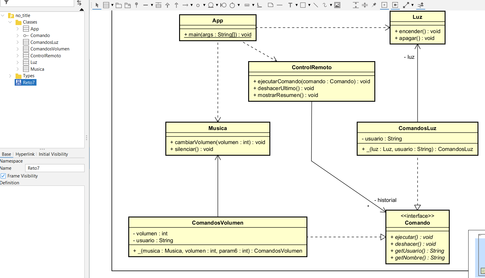

# Reto #7 – El Control Remoto Mágico

Este proyecto implementa un control remoto inteligente capaz de ejecutar acciones sobre distintos dispositivos del hogar (luz, música, etc.), permitiendo:

- Ejecutar múltiples acciones
- Pasar parámetros a cada acción
- Registrar el usuario que ejecuta cada comando
- Mantener un historial completo
- Deshacer acciones individuales
- Mostrar un resumen final de todo lo ocurrido

La solución está basada en el **patrón de diseño Command**.

## Patrón de Diseño

### Categoría

Patrones de Comportamiento

---

### Patrón Utilizado

Command

---

### Justificación

Se utilizó el patrón **Command** porque permite encapsular cada acción del control remoto como un objeto independiente.

Esto facilita:

- Agregar parámetros a las acciones (por ejemplo volumen).
- Registrar qué usuario ejecutó cada comando.
- Mantener un historial completo.
- Implementar deshacer (undo) fácilmente.
- Desacoplar el control remoto de los dispositivos reales.
- Agregar nuevos dispositivos sin modificar código existente.

---

### Cómo se aplica en el proyecto

- `Comando` es la interfaz principal del patrón.
- Cada acción concreta (encender luz, cambiar volumen) implementa dicha interfaz.
- `ControlRemoto` actúa como **Invoker**.
- `Luz` y `Musica` son los **Receivers**.
- Cada comando guarda el nombre del usuario.
- El `ControlRemoto` mantiene un historial para auditoría y undo.
- El `Main` procesa múltiples solicitudes usando una lista de comandos.

---

## Diagrama de Clases

